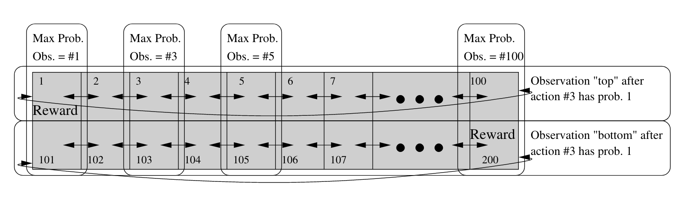
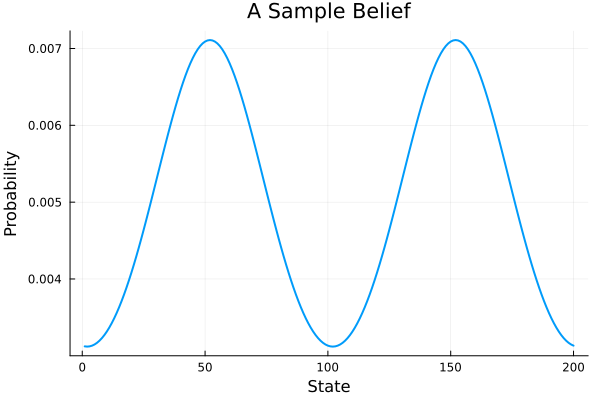

# Circular Maze

## Description 

This environment is a generalization of the Circular Maze POMDP described in [Finding Approximate POMDP solutions Through Belief Compression](https://arxiv.org/abs/1107.0053).[^1] The world consists of `n_corridor` 1D circular corridors that each have `corridor_length` states. The robot spawns in a random corridor. It must determine which corridor its in, navigate to the proper goal state, and finally declare that it has finished.



<center>
*Figure from [Finding Approximate POMDP solutions Through Belief Compression](https://arxiv.org/abs/1107.0053).
</center>

[^1]: Roy doesn't actually name his toy environment. For the original environment details, see the "PCA Performance" subsection on page 8.

## Action Space

Transitions left and right are noisy and non-deterministic. Transition probabilities are from a discrete von Mises distribution with unit concentration and mean at the target state. 

| Num | Action                 | Description                                            |
|-----|------------------------|--------------------------------------------------------|
| 1   | `CMAZE_LEFT`           | Move left with von Mises noise.                        |
| 2   | `CMAZE_RIGHT`          | Move right with von Mises noise.                       |
| 3   | `CMAZE_SENSE_CORRIDOR` | Observe the current corridor.                          |
| 4   | `CMAZE_DECLARE_GOAL`   | Ends the episode. Receive `r_findgoal` if at the goal. |

## State Space

The (ordered) state space is an array of all `CircularMazeState`s and a `terminalstate`: `[CircularMaze(1, 1), ..., CircularMaze(n_corridors, corridor_length), TerminalState()]`.

## Observation Space

The observation space is the union of the state space and `1:n_corridors`. If the robot picks `CMAZE_SENSE_CORRIDOR`, they observe the index of the current corridor. Otherwise, they observe their current state with von Mises noise.

## Rewards

The goal is to navigate to the correct goal state for the given corridor and then to declare the goal once arrived. If the robot correctly declares the goal, it receives `r_findgoal`. It incurs a `r_timestep_penalty` for every timestep it does not reach the goal. By default `r_findgoal` is 1 and `r_timestep_penalty` is 0. 

## Starting State

The initial state is sampled from a repeated, discrete von Mises distribution each with a concentration at the center of the hallway. 



## Episode End

The episode terminates once the robot declares the goal `CMAZE_DECLARE_GOAL` *regardless* of whether the robot is correct.

## Documentation

```@docs 
CircularMaze
```

```@docs 
CircularMazeState
```