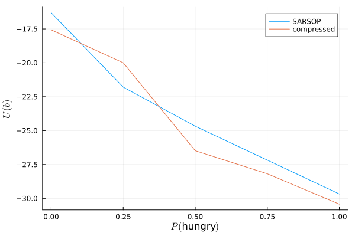

# Summary

Partially observable Markov decision processes (POMDPs) are a common framework in reinforcement learning and decision making under uncertainty, with applications in medicine [@drugs], sustainability [@carbon], economics [@markets], aerospace [@planes], and more. Unfortunately, solving real-world POMDPs with traditional methods is often computationally intractable due to the "curse of dimensionality" [@AFDM]. One way of overcome the so-called "curse of dimensionality" is belief compression. By compressing the belief distribution (i.e., the probability that the POMDP solver is in any given state at a given time), we can focus computation on the relevant belief states and solve large POMDPs. Belief compression is particularly useful when a POMDP has many states, but uncertainty is concentrated or sparse [@Roy].

# Statement of need

CompressedBeliefMDPs.jl is a Julia package [@Julia] for solving large partially observable Markov decision processes (POMDPs). It's a part of the JuliaPOMDPs ecosystem [@POMDPs.jl] and generalizes the belief compression model presented in @Roy. In particular, it exports a `CompressedBeliefMDP` and `CompressedSolver` that generalize the methods in @Roy.

# Example

Using CompressedBeliefMDPs.jl is simple.

```julia
using POMDPs
using POMDPModels
using CompressedBeliefMDPs

pomdp = BabyPOMDP()
sampler = DiscreteRandomSampler(pomdp)
compressor = PCACompressor(2)
approx_solver = CompressedSolver(pomdp, sampler, compressor)
approx_policy = POMDPs.solve(approx_solver, pomdp)
```

We see that that the compressed solver performs similarly with SARSOP [@SARSOP].

<p align="center">
  
</p>


# ExpFamilyPCA.jl

ExpFamilyPCA.jl is a forthcoming package that complements CompressedBeliefMDPs.jl. It implements not only the Poisson exponential family PCA in @Roy, but also the more general exponential family PCA from @EPCA.

# Acknowledgements

We thank Arec Jamgochian and Robert Moss for their advice.

# References